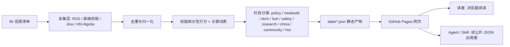

<div align="center">

# Nuclear Intel Radar

## 核能信息雷达｜全球核能/核电行业情报聚合

**自动聚合全球核能行业信息：IAEA、NRC、SMR、核聚变、铀矿燃料、运行事件 — 多源交叉验证，零噪音。**

[](LICENSE)

</div>

---

## 这是什么

一个自动更新的核能行业情报聚合站。它不只是把核能新闻抓回来，
而是先把信息源质量分级，再把同一个事件的多源报道合并成故事线，
最后用核能相关性打分 + 源健康度判断：哪些是真信号，哪些是噪音。

普通读者直接打开网页，看最近 24–72 小时全球核能/核电、SMR、核聚变、
铀矿燃料、运行事件、政策法规的精选更新。开发者可以 fork 这个仓库，
接入自己的信源清单，用 GitHub Actions 自动更新，部署到 GitHub Pages。

它不依赖任何模型额度、不需要后端服务、不消耗运行成本。

---

## 架构

零服务器纯静态 pipeline：fetch → dedup → nuclear relevance score → section classification → JSON → GitHub Pages



- **采集层**：`scripts/update_news.py`（RSS + 直接抓取 + Jina + HN + Reddit）
- **知识层**：`scripts/nuclear_keywords.py`（核能关键词表、信源分级、权重体系、栏目分类规则）
- **展示层**：`index.html` + `assets/js/*.js` + `assets/css/*.css`
- **调度层**：`.github/workflows/update-news.yml`（每 30 分钟 cron）

前端按杂志风阅读体验重设计，默认仅展示 curated 核能信号；运维诊断折叠在 `?diagnostics=1`。

---

## 信源覆盖

信源清单见 `核能行业信源汇总.xlsx`（仓库根目录外的 `C:\Users\Myfelix\RR\`），共 **95 个**：

- 73 个原始源（IAEA、NRC、NucNet、World Nuclear News、ANS Newswire、POWER Magazine、Neutron Bytes、EUROfusion、CNNC、CGN、EDF 等）
- 22 个补充源（arXiv 预印本、SMR 开发商 NuScale/TerraPower/X-energy/Kairos/Oklo/BWXT/Rolls-Royce、聚变 ITER/CFS/Helion/TAE/General Fusion、铀矿燃料 Cameco/Kazatomprom/UxC、DOE-NE/NNSA）

### 当前 Pipeline 产出（2026-07-05 最后一次运行）

- **280 raw items** from **15 sources** (15/15 OK)
- **189 nuclear-filtered items**（核能相关性过滤后）
- **11/15 active sources**，4 个 inactive（arXiv ×3 72h 内无新预印本属正常，Reddit 测试时被 rate limit）

### 已确认不可达信源

| 信源 | 原因 |
|---|---|
| 中核集团 (CNNC) | 412 Precondition Failed / 404 所有新闻页 |
| 北极星核电网 | CAPTCHA 验证墙（即使 Jina 也无法穿透） |
| EDF France | 404 所有页面（站已重构或 geo-block） |
| Reddit | 429 rate limit（手动测试触发，生产 30min 间隔可用） |

---

## 已知限制

- IAEA / NRC / ASN 等 RSS 被 Cloudflare 或 GFW 阻断，需要部署到境外 GitHub Actions 环境验证可达性。
- 微信公众号（9 个）无公开 API，MVP 暂不处理。
- 学术期刊（ScienceDirect 5 个）付费墙，用 arXiv 预印本替代。
- Reddit RSS 在生产 30 分钟间隔下可用，但手动探测会触发 rate limit。

---

## 运维诊断（Operator diagnostics）

`data/source-status.json` 暴露每个信源三种状态信号：

| 字段 | 含义 |
|---|---|
| `ok` | 网络 + 解析是否成功（HTTP 200 + feedparser 解析无报错） |
| `error` | 抓取失败时的异常信息（`ok=false` 时一定有值） |
| `warning` | 抓取成功但 0 items 时的诊断信息（silent zero） |

**Silent zero** = `ok=true, item_count=0, error=null, warning` 非空。
出现场景：
- RSS path 200 但内容是全站混合（例：DOE-NE `/rss.xml` 内容全是历史 / 太阳能 / 秘书长讲话）
- Jina fallback 抓到主页但所有链接被 skip pattern 过滤（例：OECD-NEA 主页新闻列表）
- RSS 解析成功但所有 entries 都超过 `RSS_MAX_AGE_DAYS`（14 天）
- HN / Reddit 窗口期内没有核能标签帖子

silent zero **不是 fetch 失败**，但需要人工判断信源是否值得保留：
- 如果信源本来就是混合内容（DOE-NE 全站 RSS），考虑加 nuclear relevance 阈值或放弃
- 如果是临时性 0（fresh source 还没发布新内容），可观察
- 如果持续 silent zero 跨多次运行，说明 RSS path 选错或信源已死

`tests/test_silent_zero.py` 锁住 wrapper 行为：fetcher 返 `[]` 必须带 `warning`，healthy fetcher 必须不带。

---

## 快速开始

### 部署到 GitHub Pages

1. Fork 本仓库
2. Settings → Pages → Source: GitHub Actions
3. `.github/workflows/update-news.yml` 默认每 30 分钟跑一次，无需 secrets

### 本地运行

```bash
git clone https://github.com/Myfelix-hub/nuclear-intel-radar.git
cd nuclear-intel-radar
pip install -r requirements.txt
python scripts/update_news.py --output-dir data --window-hours 72 --archive-days 21
python -m http.server 8080
```

浏览器打开 `http://localhost:8080`。

---

## 后续路线

- **P0** — 部署到 GitHub，启用 Actions + Pages，验证境外 RSS 可达性
- **P1** — 恢复 IAEA / NRC / ASN 等被 Cloudflare 拦截的 RSS
- **P2** — 微信公众号替代采集方案（搜狗微信 / RSSHub 桥）
- **P3** — Story 合并 / daily-brief 生成逻辑（合并同一事件的多源报道）

---

## License

[MIT](LICENSE)