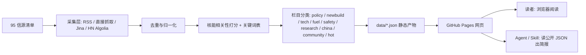

<div align="center">

# Nuclear Intel Radar

## 核能信息雷达｜全球核能/核电行业情报聚合

**自动聚合全球核能行业信息：IAEA、NRC、SMR、核聚变、铀矿燃料、运行事件 — 多源交叉验证，零噪音。**

[](LICENSE)

</div>

---

## 这是什么

一个自动更新的核能行业情报聚合站。它不只是把核能新闻抓回来，
而是先把信息源质量分级，再把同一个事件的多源报道合并成故事线，
最后用核能相关性打分 + 源健康度判断：哪些是真信号，哪些是噪音。

普通读者直接打开网页，看最近 24–72 小时全球核能/核电、SMR、核聚变、
铀矿燃料、运行事件、政策法规的精选更新。开发者可以 fork 这个仓库，
接入自己的信源清单，用 GitHub Actions 自动更新，部署到 GitHub Pages。

它不依赖任何模型额度、不需要后端服务、不消耗运行成本。

---

## 架构

零服务器纯静态 pipeline：fetch → dedup → nuclear relevance score → section classification → JSON → GitHub Pages


```mermaid
flowchart LR
    sources[95 信源清单] --> fetch[采集层: RSS / 直接抓取 / Jina / HN Algolia]
    fetch --> dedup[去重与归一化]
    dedup --> score[核能相关性打分 + 关键词表]
    score --> sections[栏目分类: policy / newbuild / tech / fuel / safety / research / china / community / hot]
    sections --> json[data/*.json 静态产物]
    json --> pages[GitHub Pages 网页]
    pages --> reader[读者: 浏览器阅读]
    pages --> api[Agent / Skill: 读公开 JSON 出简报]
```

- **采集层**：`scripts/update_news.py`（RSS + 直接抓取 + Jina + HN + Reddit）
- **知识层**：`scripts/nuclear_keywords.py`（核能关键词表、信源分级、权重体系、栏目分类规则）
- **展示层**：`index.html` + `assets/js/*.js` + `assets/css/*.css`
- **调度层**：`.github/workflows/update-news.yml`（每 30 分钟 cron）

前端按杂志风阅读体验重设计，默认仅展示 curated 核能信号；运维诊断折叠在 `?diagnostics=1`。

---

## 信源覆盖

信源清单见 `核能行业信源汇总.xlsx`（仓库根目录，本地文件不入库），共 **95 个**；当前 pipeline 实际注册 **34 个**抓取源：

- 官方 / 监管：IAEA、US NRC、US DOE-NE、OECD-NEA、国家核安全局（微信）等
- 行业媒体：World Nuclear News、ANS Newswire、POWER Magazine、Neutron Bytes、NucNet、Nuclear Engineering Int'l、中国核网
- 运营商 / 厂商：EDF、CGN、Rosatom、TerraPower、Oklo、Kairos 等
- 科研：arXiv nucl-ex / nucl-th / physics.ins-det、EUROfusion、ITER
- 社区：HN Algolia、Reddit r/nuclear
- 中文公众号（9 个，经 RSSHub 桥）：中核集团、中国核建、中国能源研究、核闻、核电那些事、国家核安全局、上海核电、中国核动力研究设计院等

### 当前 Pipeline 健康度（2026-07-30 运行）

- **34 个注册源：19 个健康 OK**，9 个微信公众号 silent zero（`RSSHUB_BASE` secret 未配置时按设计静默跳过），6 个不可达
- 实时状态见 `data/source-status.json`（每 30 分钟刷新）

### 已确认不可达信源（2026-07-30）

| 信源 | 原因 |
|---|---|
| NucNet | RSS 对 GitHub runner IP 段 403（本机直连可达） |
| US NRC | 所有 RSS/新闻路径 403，Jina 亦被 Cloudflare 拦截 |
| Nuclear Engineering Int'l | 直连与 Jina 均 403 |
| TerraPower / Oklo | Cloudflare managed challenge，直连只能拿到 JS 壳，Jina 兜底失败 |
| Rosatom | en.rosatom.ru 拒绝连接（geo-block），Jina 403 |
| 微信公众号 ×9 | 需在 repo secrets 配置 `RSSHUB_BASE`（私有 RSSHub 桥）才有数据 |

---

## 已知限制

- NucNet / NRC / TerraPower / Oklo 等被 Cloudflare 或 IP 段封锁，生产环境（境外 GitHub Actions）部分可达，本地（中国大陆）基本不可达。
- 微信公众号（9 个）经 RSSHub 桥采集，需要在 repo secrets 配置 `RSSHUB_BASE`；未配置时按设计静默跳过（silent zero），不影响其他源。
- 学术期刊（ScienceDirect 5 个）付费墙，用 arXiv 预印本替代。
- Reddit 手动探测易触发 rate limit / 403，生产 30 分钟间隔下正常工作。

---

## 运维诊断（Operator diagnostics）

`data/source-status.json` 暴露每个信源三种状态信号：

| 字段 | 含义 |
|---|---|
| `ok` | 网络 + 解析是否成功（HTTP 200 + feedparser 解析无报错） |
| `error` | 抓取失败时的异常信息（`ok=false` 时一定有值） |
| `warning` | 抓取成功但 0 items 时的诊断信息（silent zero） |

**Silent zero** = `ok=true, item_count=0, error=null, warning` 非空。
出现场景：
- RSS path 200 但内容是全站混合（例：DOE-NE `/rss.xml` 内容全是历史 / 太阳能 / 秘书长讲话）
- Jina fallback 抓到主页但所有链接被 skip pattern 过滤（例：OECD-NEA 主页新闻列表）
- RSS 解析成功但所有 entries 都超过 `RSS_MAX_AGE_DAYS`（14 天）
- HN / Reddit 窗口期内没有核能标签帖子

silent zero **不是 fetch 失败**，但需要人工判断信源是否值得保留：
- 如果信源本来就是混合内容（DOE-NE 全站 RSS），考虑加 nuclear relevance 阈值或放弃
- 如果是临时性 0（fresh source 还没发布新内容），可观察
- 如果持续 silent zero 跨多次运行，说明 RSS path 选错或信源已死

`tests/test_silent_zero.py` 锁住 wrapper 行为：fetcher 返 `[]` 必须带 `warning`，healthy fetcher 必须不带。

---

## 快速开始

### 部署到 GitHub Pages

1. Fork 本仓库
2. Settings → Pages → Source: GitHub Actions
3. `.github/workflows/update-news.yml` 默认每 30 分钟跑一次，无需 secrets
4. （可选）Settings → Secrets → 添加 `RSSHUB_BASE` 启用 9 个微信公众号源

### 本地运行

```bash
git clone https://github.com/Myfelix-hub/nuclear-intel-radar.git
cd nuclear-intel-radar
pip install -r requirements.txt
python scripts/update_news.py --output-dir data --window-hours 72 --archive-days 21
python -m http.server 8080
```

浏览器打开 `http://localhost:8080`。

---

## 后续路线

已完成：P0 部署上线、P1 信源恢复（IAEA/EDF/DOE-NE/OECD-NEA 等已在生产正常抓取）、P2 微信公众号 RSSHub 桥、P3 Story 合并 / daily-brief。

下一步：

- **信源攻坚** — 用 `NUCLEAR_PROBE=1` dump TerraPower / Oklo 真实 DOM 调优选择器；NucNet / NRC 反封锁路径
- **桥接配置** — 配置 `RSSHUB_BASE` secret 后 9 个中文公众号即上线
- **质量迭代** — 持续根据 `data/source-status.json` 清理失效源、调优核能相关性打分

---

## License

[MIT](LICENSE)